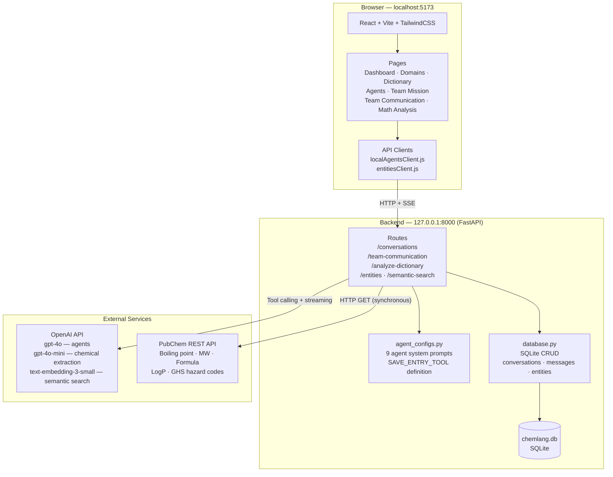
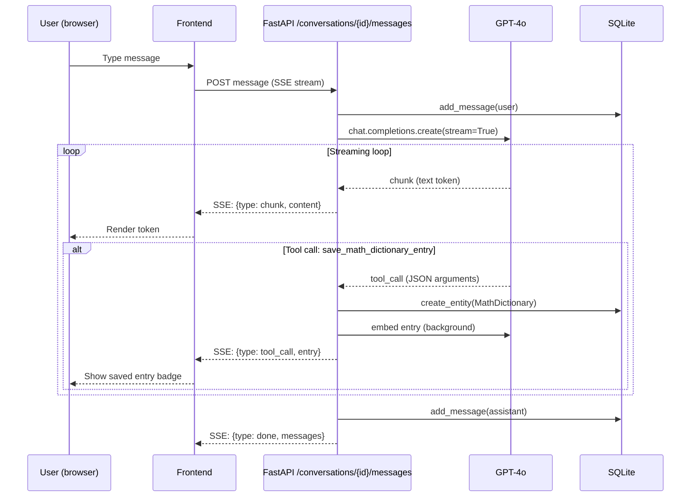
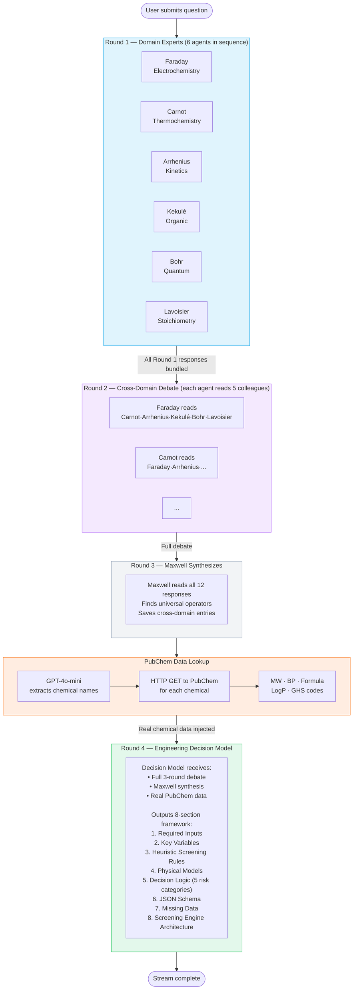
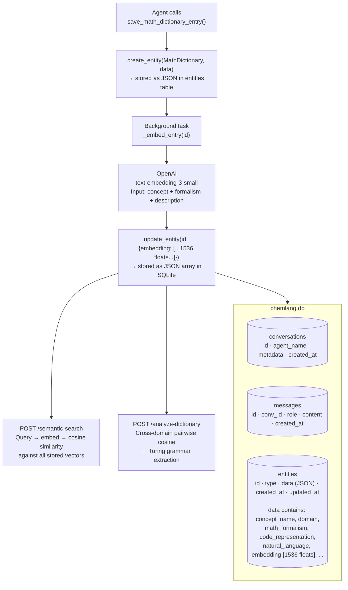

# ChemLang — System Architecture

---

## 1. System Topology

---

## 2. Agent Conversation Flow (1-on-1 Chat)

---

## 3. Team Communication — 4-Round Flow

---

## 4. Math Analysis Flow (Turing)

```mermaid
flowchart LR
    subgraph Dict["Math Dictionary (SQLite)"]
        E1["Entry: Nernst Equation\ndomain: electrochemistry\nembedding: [0.12, -0.34, ...]"]
        E2["Entry: Gibbs Free Energy\ndomain: thermochemistry\nembedding: [0.11, -0.33, ...]"]
        E3["Entry: Rate Law\ndomain: kinetics\nembedding: [0.05, 0.91, ...]"]
        EN["... N entries total"]
    end

    subgraph Backend["FastAPI /analyze-dictionary"]
        Group["Group entries\nby domain"]
        Cosine["Pairwise cosine similarity\n(cross-domain only)\nthreshold: 0.72"]
        Format["Format structured context:\n• N entries by domain\n• Top 30 cross-domain pairs"]
        Stats["Emit stats event\n→ frontend shows counts"]
    end

    subgraph Turing["Turing (GPT-4o)"]
        T1["1. Corpus Statistics"]
        T2["2. Universal Operators\n(d/dt, ln, e^x, Σ, ∇)"]
        T3["3. Equation Archetypes\n(exponential, eigenvalue,\nconservation, linear)"]
        T4["4. Cross-Domain Clusters\n(semantically equivalent\nequations)"]
        T5["5. Formal Grammar\nProduction Rules"]
        T6["6. NLP Training\nRecommendations"]
    end

    Dict --> Group --> Cosine --> Format --> Stats
    Format -->|"Structured context"| Turing
    Turing -->|"SSE stream"| FE["Frontend\nMathAnalysis.jsx"]

    style Dict fill:#0ea5e910,stroke:#0ea5e9
    style Backend fill:#a855f710,stroke:#a855f7
    style Turing fill:#22c55e10,stroke:#22c55e
```

---

## 5. Data Persistence & Embedding Pipeline

---

## 6. NLP Roadmap

```mermaid
flowchart LR
    A["Agent Sessions\n(1-on-1 + Team Mission\n+ Team Communication)"]
    -->|"save_math_dictionary_entry"| B

    B["Math Dictionary\n(growing corpus of labeled\nchemistry → math pairs)"]
    -->|"POST /analyze-dictionary"| C

    C["Turing Analysis\nProduction rules:\nchem sentence → math structure"]
    -->|"Export grammar"| D

    D["Training Dataset\n(sentence, equation) pairs\nwith domain labels"]
    -->|"Fine-tune"| E

    E["Seq2Seq NLP Model\nor LLM fine-tune\n(chemistry text → LaTeX / Python)"]
    -->|"Deploy"| F

    F["NLP Endpoint\nInput: plain English chemistry\nOutput: math formalism + Python code"]

    style A fill:#0ea5e915
    style B fill:#f9731615
    style C fill:#22c55e15
    style D fill:#a855f715
    style E fill:#ec489915
    style F fill:#eab30815
```

